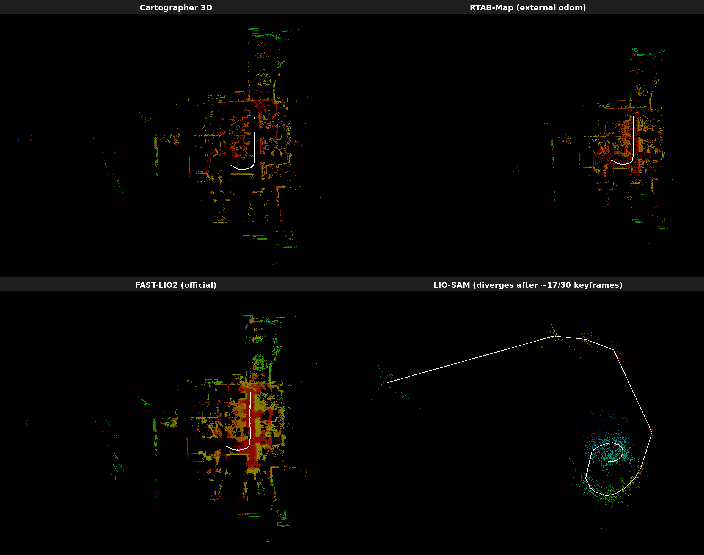
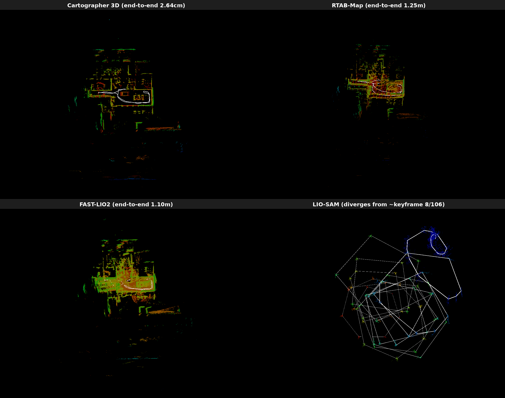

# 實驗室資料集 SLAM 比較(Compal AMR)

這份文件記錄用同一組 SLAM 系統(Cartographer 3D、RTAB-Map、LIO-SAM、FAST-LIO2)在**實驗室內部錄製的 Compal AMR 資料集**上的測試結果。跟 [README.md](README.md)/[DATASETS.md](DATASETS.md) 記錄的 11 段公開資料集不同,這裡的資料集不是公開來源,所以獨立成這份文件,不計入主要比較清單。

## spot_cartographer 跟官方 Cartographer 的差異

在跑資料集之前,先確認了 [`compal_amr_allen/amr_slam`](https://github.com/chenyuting3077/compal_amr_allen/tree/main/amr_slam) 裡的 `spot_cartographer` 套件跟官方 [`cartographer-project/cartographer`](https://github.com/cartographer-project/cartographer) 的關係:

- **不是原始碼 fork**。`spot_cartographer` 的 `package.xml` 只有 `exec_depend: cartographer_ros`,`CMakeLists.txt` 也只安裝 launch file、Lua 設定檔、rviz 設定——沒有任何 vendored 或修改過的 C++ 原始碼。實際執行時呼叫的是系統 apt 套件 `ros-jazzy-cartographer`/`ros-jazzy-cartographer-ros` 裡的 `cartographer_node`/`cartographer_offline_node`/`cartographer_assets_writer`,跟這個專案其他資料集用的是同一份官方編譯產物,原始碼層級的行為(包含 [CARTOGRAPHER_FAILURE.md](CARTOGRAPHER_FAILURE.md) 記錄的 `imu_tracker.cc` 重力斷言崩潰/靜默發散)完全一致。
- 官方 `cartographer-project` 從來沒有正式支援過 ROS2——`cartographer_ros` 一直是獨立、ROS1 時代的套件。`spot_cartographer` 的 launch file 帶有 `Copyright 2022 Wyca Robotics(for the ros2 conversion)` 標頭,來自社群的 ROS2 移植(`ros-jazzy-cartographer-ros` apt 套件實際上也是編譯自這個移植),不是官方 GitHub 組織下的程式碼。
- 真正的差異只在 Lua 參數調校跟 topic remap:`tracking_frame`/`published_frame` 設成這台機器人的座標系(`imu`/`body`)、`use_odometry = true` 接到 `/odometry`、Ceres/pose graph 權重跟 `num_range_data` 依情境(`spot_3d.lua` 線上 vs. `spot_offline_mapping.lua`/`go2_offline_mapping.lua` 離線)有不同的預設值。這些調整都沒有碰到 `imu_gravity_time_constant` 或 `ImuTracker` 本身,所以理論上前面資料集發現的發散/崩潰風險應該還是存在。

## 資料集一:rosbag2_mapping_dataset(Compal AMR,Vanjee 3D 光達,41.2 秒)

雙顆 Vanjee 3D 光達(前/後已經在錄製端融合成單一 topic `/vanjee_points719e_merged`)、真實 IMU(`/imu/data`)、真實融合里程計(`/odometry`/`/odometry_fused`),41.2 秒室內短距離移動。這份資料**沒有 ground truth**,所以沒辦法算 ATE——改用「四套系統各自獨立建置、獨立跑出來的地圖/軌跡形狀是否一致」互相驗證正確性,只用 `/vanjee_points719e_merged`(忽略未合併的 `_front`/`_rear`)跟 `/odometry`。

| 系統 | 狀態 | 路徑長度 | 姿態數 | 備註 |
|---|---|---|---|---|
| Cartographer 3D | ✅ 成功 | 11.15m | 272 | 用 `compal_amr_allen` 自己的 `spot_cartographer`(`offline_3d.launch.py` + 預設 `spot_offline_mapping.lua`)。是這個專案 12 份資料集歷史中,Cartographer 3D **第一次**兩種已知失敗模式(斷言崩潰、姿態外推器靜默發散)都沒有觸發 |
| RTAB-Map | ✅ 成功 | 10.89m | 31 | 跳過內建的 `icp_odometry`,讓 `rtabmap` 主節點直接訂閱 `/odometry` 當定位骨幹,`scan_cloud` 只用來做幾何迴環偵測跟建圖。過程中修了兩個問題:QoS 預設 BEST_EFFORT 跟 bag 錄製時的 RELIABLE 對不上,同步器完全不觸發;預設把問題當完整 6DoF 優化,在只在平面上動的 AMR 資料上讓 GTSAM 丟出「欠約束」例外,加上 `Reg/Force3DoF=true` 解決。官方的 `rtabmap-export --cloud --scan` 對這個資料庫一直匯出 0 點,原因沒有完全查清,改用「每個關鍵幀姿態配對時間戳最近的原始掃描」手動組出等效點雲 |
| FAST-LIO2(官方,未修改原始碼) | ✅ 成功 | 11.93m | 815 | 踩到預先設想到的雷:合併點雲的 `timestamp` 欄位是絕對 epoch 秒,不是官方 handler 預期的「相對掃描起始的秒數」,寫轉檔腳本修正欄位單位跟座標(含 NaN 點過濾、`base_link→imu_link` 真實外參)後正常運作。`/odometry` 不適用——FAST-LIO2 是純光達-慣性里程計,架構上沒有外部里程計輸入介面,維持官方未修改行為 |
| LIO-SAM | ❌ 發散 | — | 30(第 17 個關鍵幀後開始跳) | 用社群 ROS2 port `pixwyh/LIO-SAM-ROS2`。追出來的根因:這顆光達實際上只有 **4 條掃描線**(`ring` 全程只有 1~4 四種值),LOAM 風格依賴多線光達密度的角點/平面特徵擷取,在這麼稀疏的線數下明顯撐不住——約第 17 個關鍵幀開始出現物理上不可能的跳動(1.4 秒內跳 46 公尺),最終飄到 (-92.5, 32.9, -1.95)。過程中也在這個 port 本身抓到兩個 bug:①IMU 姿態轉換函式裡有一行忘記套用真實方向,永遠回傳單位外參旋轉,等於完全沒有用到這顆 9 軸 IMU 的真實姿態;②`lidarFrame == baselinkFrame` 時,TF 發布分支忘記設定 `frame_id`,狂噴 `TF_NO_FRAME_ID`(不影響 `mapOptimization` 本身的軌跡/點雲輸出)。`/odometry` 同樣不適用——官方 LIO-SAM 沒有外部里程計輸入介面,`odomTopic` 名稱其實是它自己輸出的 IMU 預積分結果 |

**這次最乾淨的發現**:Cartographer 3D、RTAB-Map、FAST-LIO2 三套完全獨立建置、獨立執行的系統,重建出幾乎一模一樣的房間形狀跟同一個 J 形轉彎路徑(路徑長度都落在 10.9~11.9m 之間),互相驗證了正確性,也證明 `compal_amr_allen` 的 `spot_cartographer` 設定檔在這份資料上運作正常。LIO-SAM 是唯一失敗的系統,而且原因明確指向感測器本身只有 4 條掃描線——對 LOAM 風格特徵擷取來說先天資訊量不足,不是移植過程配置錯誤。

⚠️ 這份資料只有 41 秒、動作偏溫和,Cartographer 沒有踩到 `CARTOGRAPHER_FAILURE.md` 記錄的 IMU 重力追蹤 bug,不代表這個 bug 在同一台機器人錄的更長、動作更劇烈的資料上就不會出現。

**額外發現:FAST-LIO2 有真實但輕微的垂直(z)漂移。** 這段路徑理論上全程在平面地板上,z 應該幾乎不動。三套系統裡:Cartographer 的 z 落在 [-4cm, +2.3cm],沒有明顯趨勢;RTAB-Map 因為開了 `Reg/Force3DoF=true` 把 z 強制鎖在 0;但 FAST-LIO2 的 z 從 0 開始**單調爬升**到 0.174m,41 秒內沒有回頭。規模不到「發散」的程度,但方向性很清楚——FAST-LIO2 沒有迴環偵測也沒有平面約束去修正垂直方向的小誤差,純靠 ESKF 積分,累積起來就是這種持續往一個方向飄的結果。

## 資料集二:rosbag2_mapping_dataset_2026_09_21(頭尾相同的閉環路徑,153.2 秒)

同一台 Compal AMR、同一套感測器組合,這次錄製成**閉環路徑**(起點跟終點是同一個實際位置跟朝向),所以可以比照 README.md 裡 Campus 資料集的方法,直接算「頭尾姿態距離」當精度指標,不用再靠「四套系統形狀是否一致」這種間接驗證。一樣只用 `/vanjee_points719e_merged` 跟 `/odometry`。

| 系統 | 狀態 | 頭尾誤差(端到端) | 路徑長度 | 姿態數 | 備註 |
|---|---|---|---|---|---|
| Cartographer 3D | ✅ 成功 | **2.64cm**(0.05% of path) | 52.06m | 1306 | 目前為止最準的結果。離線 log 顯示有 282 個迴環約束生效(平均分數 0.53),z 全程穩定在 [-0.8cm, 16.6cm],閉環確實有被正確偵測跟優化 |
| RTAB-Map | ✅ 成功 | 1.25m(2.4% of path) | 51.75m | 148(116 節點於工作記憶體) | 全程沒有失去追蹤、沒有錯誤,`Reg/Force3DoF=true` 的修法在這份更長的資料上依然有效 |
| FAST-LIO2(官方,未修改) | ✅ 成功 | 1.10m(1.4% of path) | 76.19m | 3057 | 純里程計、沒有迴環偵測,累積誤差比 Cartographer 大上兩個數量級,但符合預期——這正是「有沒有迴環偵測」的差異 |
| LIO-SAM | ❌ 嚴重發散 | 450m(**數字沒有意義**) | 12,608m(同樣沒有意義) | 106(第 8~9 個關鍵幀後開始跳) | 跟資料集一同一個根因(光達只有 4 條掃描線),但這次路徑更長、更複雜,崩得更早更徹底——第 8→9 個關鍵幀就跳了 3m,第 14~23 個之間跳到 13~40m,第 30 個之後單步跳動 150~250m,最終落在 (129, -63, -427)m |

**這次驗證了兩件事**:①`spot_cartographer` 在這份閉環資料上表現得比另外兩套成功的系統好上兩個數量級(2.64cm vs. 1.1~1.25m)——差異主要來自迴環偵測(Cartographer 的 pose graph 優化 + 真的偵測到 282 個約束),FAST-LIO2 完全沒有迴環機制,RTAB-Map 雖然理論上有,但這次頭尾誤差跟 FAST-LIO2 同一個量級,沒有明顯發揮迴環優勢;②LIO-SAM 在同一顆感測器上第二次發散,而且路徑越長、複雜度越高,崩潰得越早越徹底,證實資料集一的診斷(4 線光達撐不住 LOAM 特徵擷取)是穩定重現、不是單次意外。

