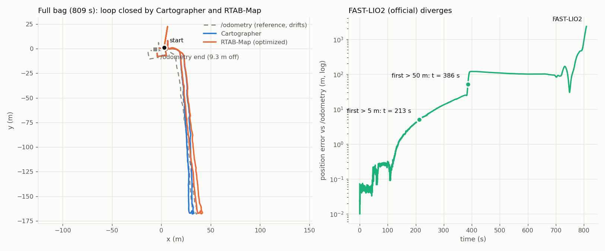
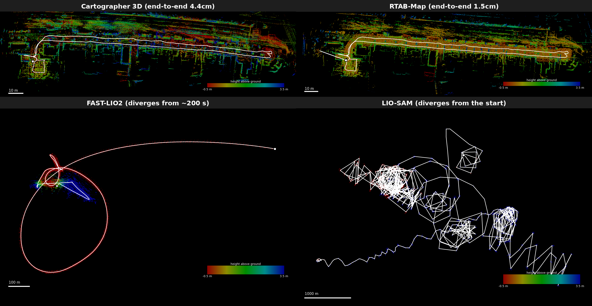
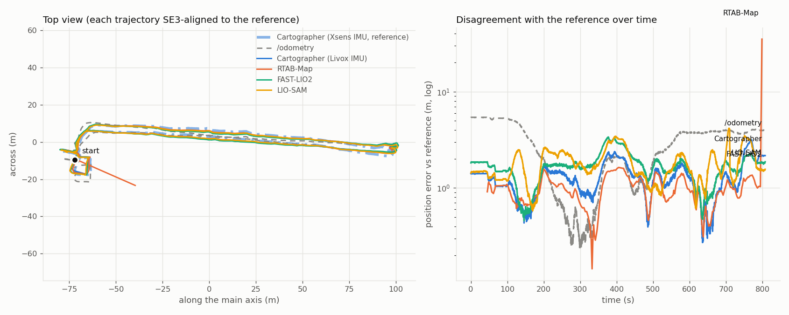
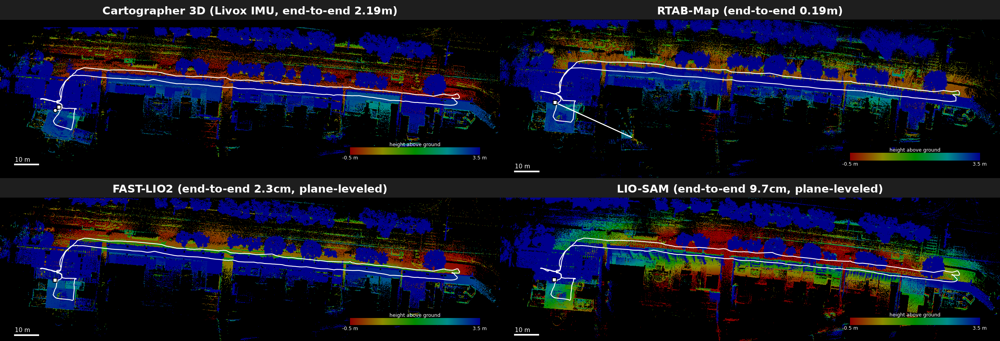
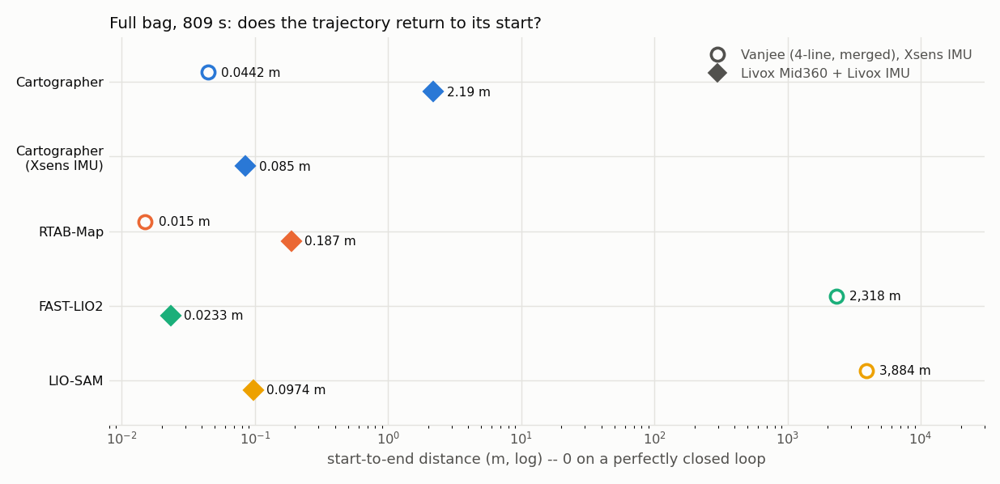

# 實驗室資料集 SLAM 比較(Compal AMR)

這份文件記錄用同一組 SLAM 系統(Cartographer 3D、RTAB-Map、LIO-SAM、FAST-LIO2)在**實驗室內部錄製的 Compal AMR 資料集**上的測試結果。跟 [README.md](README.md)/[DATASETS.md](DATASETS.md) 記錄的 11 段公開資料集不同,這裡的資料集不是公開來源,所以獨立成這份文件,不計入主要比較清單。

## spot_cartographer 跟官方 Cartographer 的差異

在跑資料集之前,先確認了 [`compal_amr_allen/amr_slam`](https://github.com/chenyuting3077/compal_amr_allen/tree/main/amr_slam) 裡的 `spot_cartographer` 套件跟官方 [`cartographer-project/cartographer`](https://github.com/cartographer-project/cartographer) 的關係:

- **不是原始碼 fork**。`spot_cartographer` 的 `package.xml` 只有 `exec_depend: cartographer_ros`,`CMakeLists.txt` 也只安裝 launch file、Lua 設定檔、rviz 設定——沒有任何 vendored 或修改過的 C++ 原始碼。實際執行時呼叫的是系統 apt 套件 `ros-jazzy-cartographer`/`ros-jazzy-cartographer-ros` 裡的 `cartographer_node`/`cartographer_offline_node`/`cartographer_assets_writer`,跟這個專案其他資料集用的是同一份官方編譯產物,原始碼層級的行為(包含 [CARTOGRAPHER_FAILURE.md](CARTOGRAPHER_FAILURE.md) 記錄的 `imu_tracker.cc` 重力斷言崩潰/靜默發散)完全一致。
- 官方 `cartographer-project` 從來沒有正式支援過 ROS2——`cartographer_ros` 一直是獨立、ROS1 時代的套件。`spot_cartographer` 的 launch file 帶有 `Copyright 2022 Wyca Robotics(for the ros2 conversion)` 標頭,來自社群的 ROS2 移植(`ros-jazzy-cartographer-ros` apt 套件實際上也是編譯自這個移植),不是官方 GitHub 組織下的程式碼。
- 真正的差異只在 Lua 參數調校跟 topic remap:`tracking_frame`/`published_frame` 設成這台機器人的座標系(`imu`/`body`)、`use_odometry = true` 接到 `/odometry`、Ceres/pose graph 權重跟 `num_range_data` 依情境(`spot_3d.lua` 線上 vs. `spot_offline_mapping.lua`/`go2_offline_mapping.lua` 離線)有不同的預設值。這些調整都沒有碰到 `imu_gravity_time_constant` 或 `ImuTracker` 本身,所以理論上前面資料集發現的發散/崩潰風險應該還是存在。

## 資料集一:rosbag2_mapping_dataset(Compal AMR,Vanjee 3D 光達,41.2 秒)

雙顆 Vanjee 3D 光達(前/後已經在錄製端融合成單一 topic `/vanjee_points719e_merged`)、真實 IMU(`/imu/data`)、真實融合里程計(`/odometry`/`/odometry_fused`),41.2 秒室內短距離移動。這份資料**沒有 ground truth**,所以沒辦法算 ATE——改用「四套系統各自獨立建置、獨立跑出來的地圖/軌跡形狀是否一致」互相驗證正確性,只用 `/vanjee_points719e_merged`(忽略未合併的 `_front`/`_rear`)跟 `/odometry`。

| 系統 | 狀態 | 路徑長度 | 姿態數 | 備註 |
|---|---|---|---|---|
| Cartographer 3D | ✅ 成功 | 11.15m | 272 | 用 `compal_amr_allen` 自己的 `spot_cartographer`(`offline_3d.launch.py` + 預設 `spot_offline_mapping.lua`)。是這個專案 12 份資料集歷史中,Cartographer 3D **第一次**兩種已知失敗模式(斷言崩潰、姿態外推器靜默發散)都沒有觸發 |
| RTAB-Map | ✅ 成功 | 10.89m | 31 | 跳過內建的 `icp_odometry`,讓 `rtabmap` 主節點直接訂閱 `/odometry` 當定位骨幹,`scan_cloud` 只用來做幾何迴環偵測跟建圖。過程中修了兩個問題:QoS 預設 BEST_EFFORT 跟 bag 錄製時的 RELIABLE 對不上,同步器完全不觸發;預設把問題當完整 6DoF 優化,在只在平面上動的 AMR 資料上讓 GTSAM 丟出「欠約束」例外,加上 `Reg/Force3DoF=true` 解決。官方的 `rtabmap-export --cloud --scan` 對這個資料庫一直匯出 0 點,原因沒有完全查清,改用「每個關鍵幀姿態配對時間戳最近的原始掃描」手動組出等效點雲 |
| FAST-LIO2(官方,未修改原始碼) | ✅ 成功 | 11.93m | 815 | 踩到預先設想到的雷:合併點雲的 `timestamp` 欄位是絕對 epoch 秒,不是官方 handler 預期的「相對掃描起始的秒數」,寫轉檔腳本修正欄位單位跟座標(含 NaN 點過濾、`base_link→imu_link` 真實外參)後正常運作。`/odometry` 不適用——FAST-LIO2 是純光達-慣性里程計,架構上沒有外部里程計輸入介面,維持官方未修改行為 |
| LIO-SAM | ❌ 發散 | — | 30(第 17 個關鍵幀後開始跳) | 用社群 ROS2 port `pixwyh/LIO-SAM-ROS2`。追出來的根因:這顆光達實際上只有 **4 條掃描線**(`ring` 全程只有 1~4 四種值),LOAM 風格依賴多線光達密度的角點/平面特徵擷取,在這麼稀疏的線數下明顯撐不住——約第 17 個關鍵幀開始出現物理上不可能的跳動(1.4 秒內跳 46 公尺),最終飄到 (-92.5, 32.9, -1.95)。過程中也在這個 port 本身抓到兩個 bug:①IMU 姿態轉換函式裡有一行忘記套用真實方向,永遠回傳單位外參旋轉,等於完全沒有用到這顆 9 軸 IMU 的真實姿態;②`lidarFrame == baselinkFrame` 時,TF 發布分支忘記設定 `frame_id`,狂噴 `TF_NO_FRAME_ID`(不影響 `mapOptimization` 本身的軌跡/點雲輸出)。`/odometry` 同樣不適用——官方 LIO-SAM 沒有外部里程計輸入介面,`odomTopic` 名稱其實是它自己輸出的 IMU 預積分結果 |

**這次最乾淨的發現**:Cartographer 3D、RTAB-Map、FAST-LIO2 三套完全獨立建置、獨立執行的系統,重建出幾乎一模一樣的房間形狀跟同一個 J 形轉彎路徑(路徑長度都落在 10.9~11.9m 之間),互相驗證了正確性,也證明 `compal_amr_allen` 的 `spot_cartographer` 設定檔在這份資料上運作正常。LIO-SAM 是唯一失敗的系統,而且原因明確指向感測器本身只有 4 條掃描線——對 LOAM 風格特徵擷取來說先天資訊量不足,不是移植過程配置錯誤。

⚠️ 這份資料只有 41 秒、動作偏溫和,Cartographer 沒有踩到 `CARTOGRAPHER_FAILURE.md` 記錄的 IMU 重力追蹤 bug,不代表這個 bug 在同一台機器人錄的更長、動作更劇烈的資料上就不會出現。

**額外發現:FAST-LIO2 有真實但輕微的垂直(z)漂移。** 這段路徑理論上全程在平面地板上,z 應該幾乎不動。三套系統裡:Cartographer 的 z 落在 [-4cm, +2.3cm],沒有明顯趨勢;RTAB-Map 因為開了 `Reg/Force3DoF=true` 把 z 強制鎖在 0;但 FAST-LIO2 的 z 從 0 開始**單調爬升**到 0.174m,41 秒內沒有回頭。規模不到「發散」的程度,但方向性很清楚——FAST-LIO2 沒有迴環偵測也沒有平面約束去修正垂直方向的小誤差,純靠 ESKF 積分,累積起來就是這種持續往一個方向飄的結果。

## 資料集二:rosbag2_mapping_dataset_2026_09_21(頭尾相同的閉環路徑,153.2 秒)

同一台 Compal AMR、同一套感測器組合,這次錄製成**閉環路徑**(起點跟終點是同一個實際位置跟朝向),所以可以比照 README.md 裡 Campus 資料集的方法,直接算「頭尾姿態距離」當精度指標,不用再靠「四套系統形狀是否一致」這種間接驗證。一樣只用 `/vanjee_points719e_merged` 跟 `/odometry`。

| 系統 | 狀態 | 頭尾誤差(端到端) | 路徑長度 | 姿態數 | 備註 |
|---|---|---|---|---|---|
| Cartographer 3D | ✅ 成功 | **2.64cm**(0.05% of path) | 52.06m | 1306 | 目前為止最準的結果。離線 log 顯示有 282 個迴環約束生效(平均分數 0.53),z 全程穩定在 [-0.8cm, 16.6cm],閉環確實有被正確偵測跟優化 |
| RTAB-Map | ✅ 成功 | 1.25m(2.4% of path) | 51.75m | 148(116 節點於工作記憶體) | 全程沒有失去追蹤、沒有錯誤,`Reg/Force3DoF=true` 的修法在這份更長的資料上依然有效 |
| FAST-LIO2(官方,未修改) | ✅ 成功 | 1.10m(1.4% of path) | 76.19m | 3057 | 純里程計、沒有迴環偵測,累積誤差比 Cartographer 大上兩個數量級,但符合預期——這正是「有沒有迴環偵測」的差異 |
| LIO-SAM | ❌ 嚴重發散 | 450m(**數字沒有意義**) | 12,608m(同樣沒有意義) | 106(第 8~9 個關鍵幀後開始跳) | 跟資料集一同一個根因(光達只有 4 條掃描線),但這次路徑更長、更複雜,崩得更早更徹底——第 8→9 個關鍵幀就跳了 3m,第 14~23 個之間跳到 13~40m,第 30 個之後單步跳動 150~250m,最終落在 (129, -63, -427)m |

**這次驗證了兩件事**:①`spot_cartographer` 在這份閉環資料上表現得比另外兩套成功的系統好上兩個數量級(2.64cm vs. 1.1~1.25m)——差異主要來自迴環偵測(Cartographer 的 pose graph 優化 + 真的偵測到 282 個約束),FAST-LIO2 完全沒有迴環機制,RTAB-Map 雖然理論上有,但這次頭尾誤差跟 FAST-LIO2 同一個量級,沒有明顯發揮迴環優勢;②LIO-SAM 在同一顆感測器上第二次發散,而且路徑越長、複雜度越高,崩潰得越早越徹底,證實資料集一的診斷(4 線光達撐不住 LOAM 特徵擷取)是穩定重現、不是單次意外。

## 資料集三:rosbag2_2026_09_21-07_28_09_no_camera(809 秒、單向約 172m 的長直線來回,四套系統改用官方版本)

同一台 Compal AMR,錄了 13.5 分鐘,沿一條約 172m 的長直線往返(折返點約在 396 秒)。只用 `/vanjee_points719e_merged`(4 線)、`/imu/data`(約 66Hz)、`/odometry`、`/tf_static`;bag 裡的 Livox(`/livox/lidar`、`/livox/imu`)另外跑,見後面「資料集三(續)」。**沒有 ground truth**,所以下表的 ATE 是對照 `/odometry`(輪式/融合里程計)算的,而 `/odometry` 本身會漂(首尾相距 9.33m,路徑 426.39m),它只是參考,不是真值。

**這次跟資料集一、二的差別**:四套系統都改成官方版本——Cartographer 用 apt 官方套件加 `spot_cartographer` 的 `spot_offline_mapping.lua`、RTAB-Map 用 apt 官方套件(以 `/odometry` 為骨幹、`Reg/Force3DoF=true`)、FAST-LIO2 用 `hku-mars/FAST_LIO` 未修改原始碼、LIO-SAM 用官方 `TixiaoShan/LIO-SAM` 的 `ros2` 分支(commit `08af3f3`;只加一個編譯用 patch,把 `find_package(Eigen)` 改成 `Eigen3`,見 `slam_comparison/docker/lio_sam_official_build_fix.patch`)。資料集一、二的 LIO-SAM 用的是社群 port `pixwyh/LIO-SAM-ROS2`,不是同一份程式碼。工具鏈打包成三個 docker 映像(`slam_comparison/docker/`),四套系統在同一台機器上平行跑;RTAB-Map、FAST-LIO2、LIO-SAM 是即時播放(1x),Cartographer 是離線處理。

### 全段(809.1 秒)

| 系統 | 狀態 | 首尾距離 | 路徑長度 | 姿態數 | ATE vs `/odometry` | 備註 |
|---|---|---|---|---|---|---|
| Cartographer 3D | ✅ 成功 | **0.044m** | 443.95m | 9600 | 2.94m(最大 5.80m) | 14157 次約束計算裡有 767 個成為新約束,沒有崩潰或斷言。z 範圍 [-1.48, 1.29]m |
| RTAB-Map | ✅ 成功(尾端有一小段異常) | **0.015m** | 469.79m | 556 | 3.10m(最大 23.6m) | 資料庫 634 個節點,1486 條局部空間鄰近連結,沒有全域迴環(沒有影像),6 次迴環被判定為錯誤而拒絕。優化後的位姿裡,t≈798 秒附近少數幾個節點跳離約 22m(最大誤差來源),其餘正常。z 被 `Force3DoF` 鎖在 0 |
| FAST-LIO2(官方) | ❌ 發散 | 2318m | 4543m | 16135 | 196.3m(最大 2254m) | 誤差在 213 秒超過 5m、386 秒超過 50m,終點 z=-2053m;log 有 148 次 `No Effective Points!` |
| LIO-SAM(官方) | ❌ 發散 | — | 244,576m | 681 個關鍵幀 | — | 475 次 `Large velocity, reset IMU-preintegration!`,z 被夾在預設的 ±1000m 上限(`z_tollerance`) |

**能確定的事**:
- Cartographer 和 RTAB-Map 兩套獨立系統都把路徑閉合到公分等級(4.4cm、1.5cm),而 `/odometry` 首尾相距 9.33m,所以這條路徑應該是回到起點的閉環(這是推論,沒有人工確認)。兩者的軌跡彼此吻合:對齊後中位數相差 1.17m、95 百分位 2.0m(不含上面那個 22m 的尖點)。
- FAST-LIO2 在前 3 分鐘還跟參考吻合(ATE 0.16m),之後誤差從約 2 分鐘起持續放大,到折返點附近(396 秒)已超過 50m,終點離起點 2318m。LIO-SAM 全程無法使用。

**不能下的結論**:
- 沒有 ground truth,不能說 Cartographer 比 RTAB-Map「更準」。往返兩趟的橫向間距(回程到去程路徑的最近距離,離起點 20m 以外)是:`/odometry` 平均 1.97m,Cartographer 3.45m,RTAB-Map 3.53m——兩套 SLAM 並沒有比原始里程計更「重疊」,但回程本來就可能走不同車道,所以這個數字也不能當作誤差。
- FAST-LIO2 為什麼發散,我沒有驗證。前 396 秒都是筆直的長路徑,誤差隨距離持續增加,跟 LegKilo `corridor.bag` 上觀察到的「長走廊幾何退化」模式相符,但這只是推測,而且後面 Livox 那組在同一條路徑上用同一份官方 FAST_LIO 沒有發散,所以不太像是路徑本身造成的。
- LIO-SAM 的失敗跟資料集一、二同一類(這顆光達只有 4 條線,LOAM 風格特徵擷取先天不足);這次用官方版本,一樣失敗,而且更早——3 分鐘試跑裡第 2 個關鍵幀起 z 每幀掉 1~2m。

讀圖注意:顏色是**離地高度**,配色跟其他資料集的圖一樣(紅=低、藍=高),但四格用同一條固定色帶(-0.5m 到 3.5m,超出範圍的夾在兩端顏色),其他資料集的圖則是各自拉伸,所以同色代表同高度。離地高度是用各系統軌跡起點的 z 加上該座標系離地的高度換算的(假設起點附近地面是平的;`tf_static` 裡 `base_footprint→base_link` 是 0.1457m,Cartographer 與 FAST-LIO2 追蹤的是 `imu_link`,再高 0.077m,共 0.2227m)。發散的兩格(FAST-LIO2、LIO-SAM)大部分點的高度早已飄出色帶,會被夾成同一個顏色,只有起點附近保有正常的顏色。RTAB-Map 開了 `Force3DoF`,位姿是水平的,所以車身傾斜造成的高度差沒有被補償,跟 Cartographer 的 6 自由度結果在細節上會不一樣。每一格的比例尺不同(左下角的白色線段,分別是 10m、10m、100m、1000m),俯視方向已旋轉成軌跡主軸水平,方形標記是終點、圓點是起點。點雲來源也不同:Cartographer 是 `cartographer_assets_writer` 輸出(有移除移動物體的濾波,隨機取 400 萬點繪圖);RTAB-Map 的 `rtabmap-export` 匯出 0 個點,所以是用優化後的節點位姿加上對應的原始掃描自己組出來的(體素 0.1m,`assemble_rtabmap_cloud.py`);FAST-LIO2 是它存下的整張累積地圖(隨機取 400 萬點);LIO-SAM 是 `cloudGlobal.pcd`。RTAB-Map 那格右端往外延伸的白線,就是上面提到尾端約 22m 的尖點。

### 先跑的 3 分鐘試通(前 180 秒、3596 幀)

| 系統 | 結果(ATE 對照 `/odometry`) |
|---|---|
| Cartographer 3D | 0.237m,路徑 56.24m(`/odometry` 為 53.94m) |
| RTAB-Map | 0.128m,路徑 53.85m |
| FAST-LIO2(官方) | 0.164m;xy 吻合,但 z 持續上升到 3.46m |
| LIO-SAM(官方) | 發散(路徑 8315m,終點離起點 1149m) |

### 這次踩到的東西

- **RTAB-Map 匯出**:`export_rtabmap_trajectory.py` 讀的是資料庫 `Node.pose`,那是**未優化的里程計位姿**(這次全程跟 `/odometry` 相差 0.00m),不是迴環優化後的結果。這份資料改用 `rtabmap-export --poses --opt 0` 匯出優化後位姿。
- **FAST-LIO 外參符號**:`extrinsic_T` 是「光達在 IMU 座標系的位置」,所以要填 `base_link→imu_link` 平移量的**負值**(-0.1266, 0, -0.077)。資料集二的設定檔填的是正值。我在 3 分鐘資料上兩種符號都跑過,結果差異可忽略(ATE 0.164m vs 0.155m,z 上飄同樣約 3.5m),所以 z 上飄不是符號造成的。
- **LIO-SAM 官方版**:輸出的 `transformations.pcd` 是 ASCII 格式,`export_liosam_trajectory.py` 已補上支援;關鍵幀時間戳因為精度被截斷,不能用來做時間對齊。官方版一樣會噴 `TF_NO_FRAME_ID`(不影響 `mapOptimization` 的輸出)。
- 重跑方式:`bash slam_comparison/docker/run_lab_all.sh <切好的 bag> <標籤>`;原始資料、轉檔、映像備份都在 `data/`,輸出在 `outputs/compal_amr/<標籤>/<系統>/`(可用環境變數 `OUTNAME` 改資料夾名稱;兩者都不在 git 裡)。

## 資料集三(續):同一份 bag 的 Livox Mid360 光達(全段 809 秒,四套系統、官方版本)

同一段錄影、同一條路徑,這次改用 bag 裡的 Livox Mid360(`/livox/lidar`,`livox_ros_driver2/CustomMsg`,10Hz、每幀約 2 萬點、4 條線)和它自己的 IMU(`/livox/imu`,200Hz)。**沒有 ground truth**,閉環同樣是推論。

**資料上的三個坑**(都不是演算法問題,但不處理就跑不起來):
- **frame 對不上**:點雲的 `frame_id` 是 `livox_link`(`tf_static` 有 `base_link→livox_link`,俯仰 20°),但 `/livox/imu` 是 `livox_frame`,TF 裡沒有這個 frame。處理方式:IMU 維持 `livox_frame`,點雲轉檔時也改標成 `livox_frame`,並補一條 `livox_link→livox_frame` 的單位轉換 TF(視為同一顆感測器,Livox 內部 IMU 與光達原點的幾公分偏移交給各演算法的外參)。
- **IMU 單位是 g**(靜止時 |a|≈1.0),而且**沒有姿態**(`orientation` 是單位四元數、共變異數 0,是 6 軸 IMU)。Cartographer 與 LIO-SAM 拿到的是換成 m/s² 的版本;官方 FAST_LIO 會自己依重力重新縮放,所以它拿原始單位。
- **Cartographer 要求點雲的「最後一個點時間最大」**,而 Livox 的點沒有按時間排序,第一次跑因此在 `msg_conversion.cpp` 斷言崩潰;轉檔時把點依時間排序即可。

**各系統用的 IMU 與輸入**:

| 系統 | IMU | 輸入與設定 |
|---|---|---|
| Cartographer 3D | `/livox/imu`(另外一次用 `/imu/data`,即 Xsens) | 點雲轉成 Velodyne 格式的 PointCloud2(`ring`=Livox `line`、`time`=`offset_time`),加 `/odometry`;實驗室的 `spot_offline_mapping.lua`,只把 `tracking_frame` 改成 `livox_frame`(Xsens 版則完全不改) |
| RTAB-Map | 不用 IMU | 同 Vanjee 那組(`/odometry` 當里程計骨幹、`Reg/Force3DoF`),掃描改成 Livox 點雲 |
| FAST-LIO2(官方) | `/livox/imu` | 官方 `mid360.yaml` **完全未修改**,輸入是真正的 `CustomMsg`(ROS2 的 `CustomMsg` 只是重新編碼成 ROS1 的 `livox_ros_driver/CustomMsg`,點與 `offset_time` 原樣保留,去形變由 FAST_LIO 自己做) |
| LIO-SAM(官方) | `/livox/imu` | 官方 ROS2 分支,`sensor: livox`、`N_SCAN: 4`、`Horizon_SCAN: 6000`(Livox 模式依到達順序給每條線的點編欄位,所以要大於每線點數約 5000)、`lidarFrame=baselinkFrame=livox_frame`、外參用 Livox 規格(IMU 在光達座標系 (11, 23.29, -44.12)mm) |

**結果**(對照 `/odometry` 的 ATE 是 SE3 對齊後的 RMSE;`/odometry` 首尾相距 9.33m、會漂,所以這欄只是參考):

| 系統 | 狀態 | 首尾距離 | 路徑長度 | 姿態數 | ATE vs `/odometry` | 備註 |
|---|---|---|---|---|---|---|
| Cartographer(Livox IMU) | ✅ | 2.19m | 436.01m | 5432 | 3.02m(最大 6.09m) | 4337 次約束計算中 837 個成為新約束;z 範圍 [-0.47, 0.18]m |
| Cartographer(Xsens IMU) | ✅ | **0.085m** | 444.86m | 6289 | 2.97m(最大 6.13m) | 5854 次中 518 個約束;z 範圍 [-1.70, 1.12]m |
| RTAB-Map | ✅(尾端有尖點) | 0.187m | 494.37m | 270 | 3.76m(最大 34.0m) | 資料庫 322 個節點、37 次迴環被拒;t≈799 秒附近少數節點跳離約 33m(跟 Vanjee 那組同一個現象) |
| FAST-LIO2(官方) | ✅ | **0.023m** | 442.59m | 8088 | 3.31m(最大 5.26m) | 純里程計、沒有迴環,沒有發散 |
| LIO-SAM(官方) | ✅ | 0.097m | 445.49m | 3553 | 3.52m(最大 6.00m) | 最後一次執行 0 次 IMU 重置(見下) |

**能確定的事**:
- 這次四套系統都能用 Livox 跑完全段。同一條路徑、同一份官方 FAST_LIO 與 LIO-SAM,用 Vanjee 的 4 線光達時兩者都發散,用 Livox 時都正常(FAST-LIO2 首尾只差 2.3cm)。我沒有把原因拆開驗證:可能是光達(密度與視野)、也可能是 IMU,兩個變因是一起換的。
- 各系統彼此吻合:以 Cartographer(Xsens IMU)為參考,SE3 對齊後 Cartographer(Livox IMU)相差 1.36m、FAST-LIO2 1.77m、LIO-SAM 1.95m、RTAB-Map 2.36m(RTAB-Map 另有那個 35m 的尖點)。它們都比對照 `/odometry` 的 3.0~3.8m 近,因為那個數字主要來自 `/odometry` 自己的漂移。
- Cartographer 換 Livox IMU 或 Xsens IMU 都能跑,但結果不同:Xsens 版首尾閉合到 8.5cm(Livox IMU 版是 2.19m),Livox IMU 版的 z 起伏較小。這只有單次執行,不能據此說哪顆 IMU 比較好。

**要小心的事**:
- **FAST-LIO2 與 LIO-SAM 的世界座標系是傾斜的**:6 軸 Livox IMU 沒有姿態,而 Livox 相對車體有 20° 俯仰(靜止時重力偏離感測器 z 軸 19.8°),所以它們的「z」不是垂直方向。FAST-LIO2 的 z 在折返點掉到 -62m(172m × sin20° ≈ 59m,符合),LIO-SAM 掉到 -34m;Cartographer 用 IMU 對齊重力,z 在 ±1.7m 內。表裡的 z 範圍與 ATE(SE3 對齊)不受影響,但畫地圖時這兩個系統要先扶正,我用的是「軌跡擬合平面」(假設機器人在近乎平坦的路面上行駛)。
- **LIO-SAM 官方要求 9 軸 IMU**,這裡姿態是單位四元數(等於假設感測器是水平的),實際上有 20° 傾斜。最後一次全段執行仍然順利,但這是官方版本在超出文件要求的條件下運作,不代表這是建議的用法。
- **LIO-SAM 有一次啟動就崩潰**:全段的兩次檢查過的執行裡,有一次 `imuPreintegration` 在播放一開始因 GTSAM 的 `IndeterminantLinearSystemException`(初始化時線性系統不定)abort,之後整段都在沒有 IMU 預積分的降級模式下跑(漂移到 74m,這次結果我丟棄了);沒改任何程式碼,重跑一次就正常。3 分鐘試跑沒有發生。
- RTAB-Map 的點雲圖是自己用優化後位姿加原始掃描組的(`rtabmap-export` 又是 0 個點),容許 0.06 秒的時間差。

四宮格的比例尺都是 10m;FAST-LIO2 與 LIO-SAM 用軌跡擬合平面扶正,離地高度以感測器離地約 0.337m(`base_footprint→base_link` 0.1457m 加 `base_link→livox_link` 的 0.1913m)換算。單張圖在 `docs/images/compal_amr/livox_full_individual/`。

兩顆光達放在一起看,每個系統的首尾距離(不是精度排名,只是「有沒有回到起點」):

**其他**:3 分鐘試跑四套都能跑通(Cartographer ATE 0.21m、FAST-LIO2 0.39m;LIO-SAM 當時匯出的時間戳被截斷,沒算 ATE)。資料與結果在 `data/lab3_livox_full`(切好的原始段)、`data/livoxfull_ros2`、`data/livoxfull_fastlio.bag`(轉檔後),結果在 `outputs/compal_amr/dataset3_livox_full/`;重跑用 `bash slam_comparison/docker/run_lab_livox_all.sh data/lab3_livox_full livoxfull`(要指定資料夾名稱就加 `OUTNAME=dataset3_livox_full`),Xsens IMU 版用 `run_lab_livox_carto_xsens.sh`。
