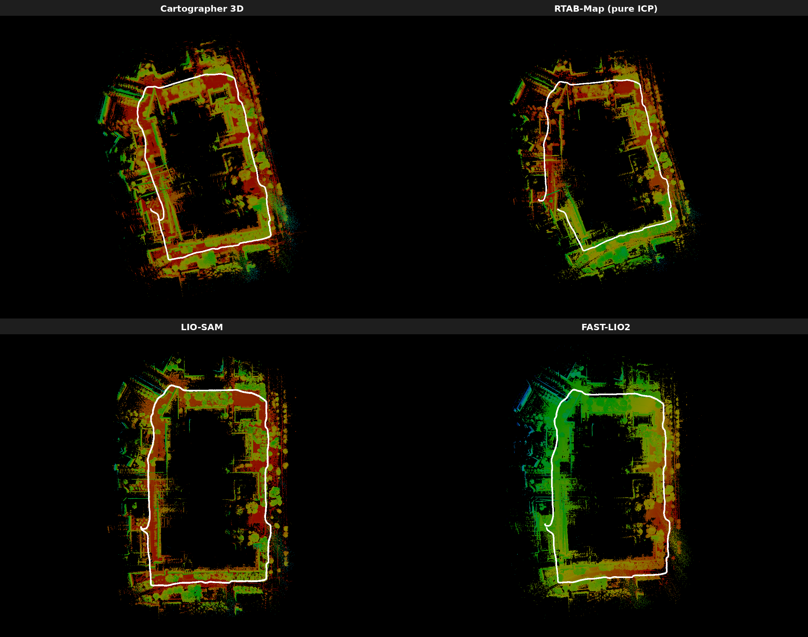
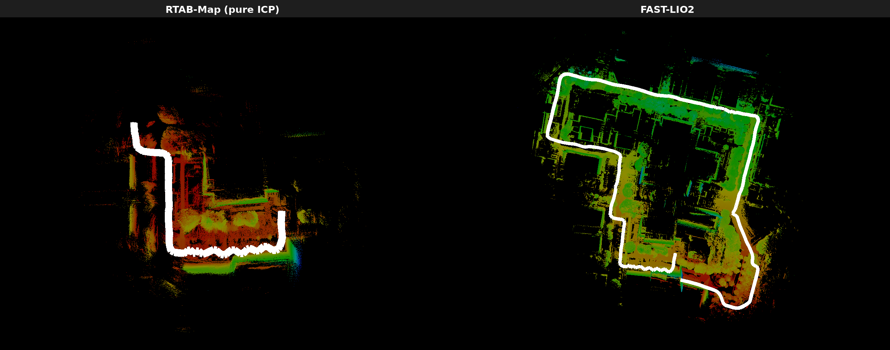
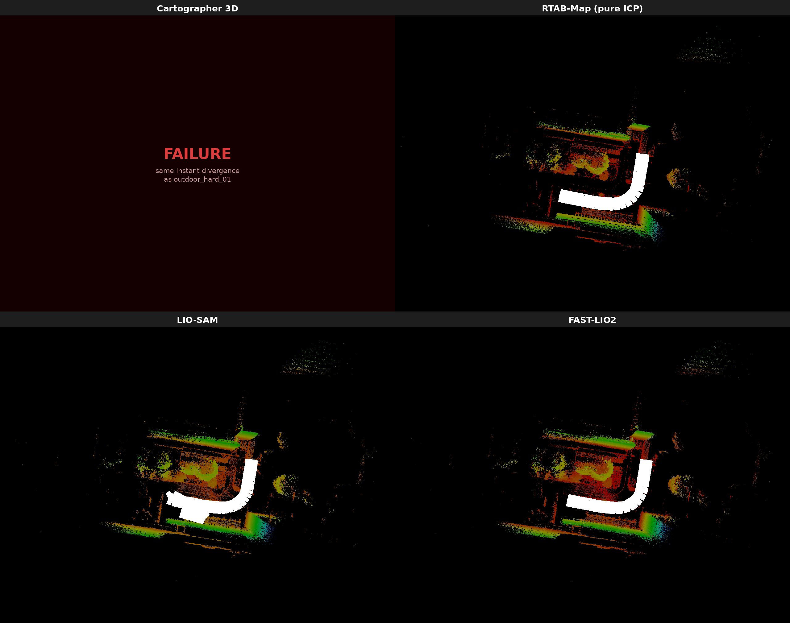
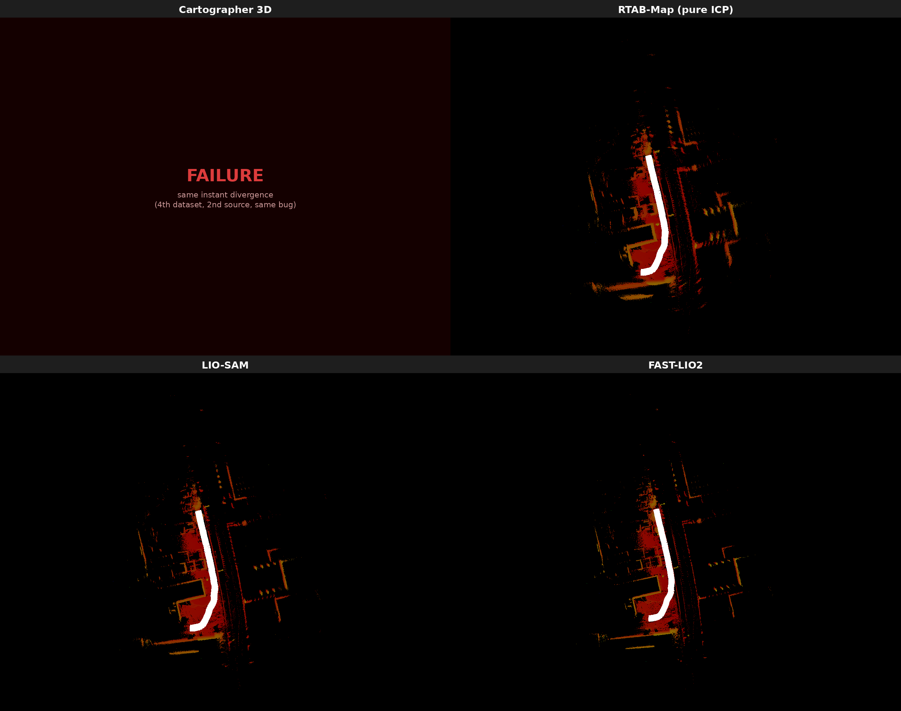
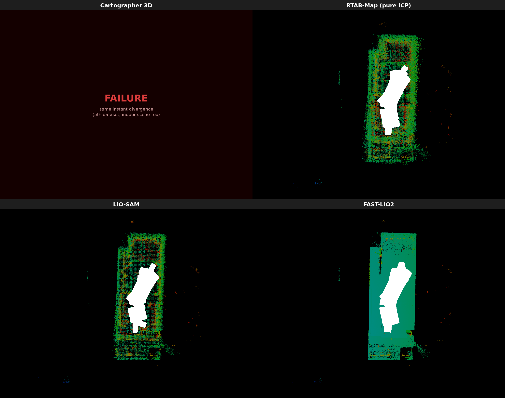

# SLAM 系統比較實驗

用四套 SLAM 系統(Cartographer 3D、RTAB-Map、LIO-SAM、FAST-LIO2)在多份不同感測器、不同來源、不同性質的資料集上跑,比較精度跟強健性。各資料集的細節、格式差異、跟四套系統各自的移植過程,見 [DATASETS.md](DATASETS.md)。

## 資料集一:Campus(LIO-SAM 官方資料集,Velodyne VLP-16)

閉環路徑,1437m,用「終點誤差」(首尾姿態距離)對照論文數字。

| 指標 | LOAM(論文) | LIO-odom(論文) | LIO-GPS(論文) | LIO-SAM(論文) | **Cartographer 3D** | **RTAB-Map** | **LIO-SAM** | **FAST-LIO2** |
|---|---|---|---|---|---|---|---|---|
| End-to-end translation error (m) | 192.43 | 9.44 | 6.87 | 0.12 | 31.67 | 163.67 | 0.288 | 9.575 |

詳細分析、迴環偵測除錯過程、為什麼緊耦合系統明顯領先,見 [outputs/comparison_report.md](outputs/comparison_report.md)。

## 資料集二:Mid360 outdoor_hard_01(Zenodo,Livox Mid360)

非閉環路徑(起終點相距 18.4m),998.9m,官方資料集本身設計成「快速運動、點雲劣化」的困難場景,附完整連續 ground truth(5147 筆),用 ATE(絕對軌跡誤差,Umeyama SE3 對齊後算 RMSE)評估。

| 系統 | 狀態 | ATE RMSE | 軌跡長度 | 備註 |
|---|---|---|---|---|
| Cartographer 3D | ❌ 發散 | — | — | 即時播放下,`odom->livox_frame` 的姿態外推器很快開始二次方式發散(幾分鐘內飄到數千萬公尺)。`imu_gravity_time_constant` 調小(→1s)讓 submap 插不進去,調大(→30s)發散得更快(95秒內飄到 -6200 萬公尺),兩個方向都沒用,判定不是這個參數能解的問題,姿態外推器本身無法處理這段路的劇烈運動,列為已知限制 |
| RTAB-Map(純 ICP) | ⚠️ 部分成功 | **0.944m** | 170.95m(全長 998.9m 的 17%) | ATE 數字看起來很漂亮,但只是因為它在追蹤到 170m 左右就停止累積新的節點(跟 log 裡觀察到的 ICP 註冊間歇性失敗一致)——不是穩健地跑完全程,是提早放棄後剩下的一小段track 得準 |
| LIO-SAM | ⚠️ 前段正確,後段發散 | 520.76m(全段,已失去意義) | 前 69 秒/204m 正確 | 用社群 fork `rajvishnu07/lio_sam_mid360`(ROS2 Humble)+ 修正兩個 bug(TF 空 frame_id、時間欄位單位錯誤)後,前 20% 的路徑姿態合理,但 t≈985s 開始跳動幅度一路擴大到 20m+,最終飄到 z=-1000m 級的離群值。推測跟這個 fork 用垂直角度湊出的人工「ring」在快速運動下抽出壞特徵有關,壞的因子被序列式地加進 GTSAM 因子圖後回不去 |
| FAST-LIO2 | ✅ 成功 | **5.228m** | 968.41m(全長 998.9m 的 97%) | 官方 ROS1 版,寫了轉檔腳本把 PointCloud2 還原成真正的 `livox_ros_driver::CustomMsg` 餵給官方未修改的 `mid360.yaml`。沒有迴環偵測,純里程計在這段「hard」序列上飄了 5.2m,但完整跑完了 97% 的路徑長度 |

**這次最有意思的發現**:RTAB-Map 的 ATE 數字(0.944m)比 FAST-LIO2(5.228m)漂亮,但那是因為它只成功追蹤了 17% 的路徑就停滯,LIO-SAM 也是同樣的模式(前 20% 正確、之後完全發散)——都不是「更準」,是「提早放棄/失去追蹤」。單看 ATE 數字會誤導,必須同時看軌跡覆蓋率才能公平比較。**四套系統裡只有 FAST-LIO2 完整跑完了整段路**:它沒有迴環偵測,累積誤差確實最大,但也因此不受「因子圖被污染後回不去」「ICP 找不到配對就整段卡住」這類問題影響,是這次測試最穩健的系統。

## 資料集三:Mid360 outdoor_kidnap(同一 Zenodo 資料集,不同情境)

同一個感測器/格式,但這次是官方標示的 **"kidnap"**(重定位)情境,不是「快速運動」。553.8 秒、743.3m,非閉環。

| 系統 | ATE RMSE(成功片段) | 成功追蹤路徑佔比 |
|---|---|---|
| Cartographer 3D | ❌ 失敗 | 0% |
| RTAB-Map(純 ICP) | 0.073m | 5.0% |
| LIO-SAM | 2.168m | 8.6%(之後姿態直接凍結,不是漸進發散) |
| FAST-LIO2 | 0.057m | 4.9% |

**最乾淨的發現**:RTAB-Map、LIO-SAM、FAST-LIO2 三套系統畫出來的地圖幾乎是同一個形狀,失敗時間點也都落在路徑的 5~9% 左右——強烈指向那個時間點附近真的發生了一次 kidnap 事件,三套完全不同架構的系統幾乎同時一起失去追蹤。更值得注意的是:**FAST-LIO2 在 outdoor_hard_01 上最穩健(跑完 97%),面對 kidnap 卻是最早失敗的系統之一(4.9%)**——證明「哪套系統更好」高度取決於失敗模式的種類,沒有放諸四海皆準的排名。

## 資料集四~七:TIERS `multi_modal_lidar_dataset`(獨立第三方來源,同樣是 Mid360)

前三份 Mid360 資料集都來自同一個 Zenodo 上傳者。這 4 段來自完全獨立的 [TIERS 大學資料集](https://github.com/TIERS/multi_modal_lidar_dataset)(2 段戶外道路 + 2 段室內辦公室),用不同的錄製硬體、不同的 ground truth 系統(戶外 GNSS-RTK、室內 MoCap),驗證前面觀察到的 Cartographer 發散 bug 是不是 Zenodo 資料集本身的問題。詳細格式差異、意外發現的 `ros2 bag` 相容性 bug,見 [DATASETS.md](DATASETS.md#4-tiers-multi_modal_lidar_dataset獨立第三方資料集同樣是-mid360)。

| 資料集 | Cartographer 3D | RTAB-Map | LIO-SAM | FAST-LIO2 |
|---|---|---|---|---|
| OutdoorRoad_cut1(45.3s/48.3m) | ❌ 發散 | 0.220m | **3.688m** | 0.134m |
| OutdoorRoad_cut0(66.0s/80.3m) | ❌ 發散 | 0.088m | 0.101m | 0.079m |
| IndoorOffice1(66.2s) | ❌ 發散 | 0.038m | 0.030m | 0.030m |
| IndoorOffice2(95.7s) | ❌ 發散 | 0.046m | 0.034m | 0.037m |

(數字為 ATE RMSE,四段資料的三套存活系統都是全程完整追蹤,不像 Zenodo 的困難序列會提早失去追蹤。)

**這份獨立資料集把 Cartographer 的發散 bug 確認到第 6 次**,而且首次驗證了「室內、低速移動」場景一樣會發散,排除了「只在戶外快速運動時才會觸發」的假設。另一個乾淨的發現是**室內場景的精度明顯優於戶外**(4~5cm vs 8~22cm ATE)——室內牆面/家具提供的幾何特徵遠比開放道路密集,對三套存活系統來說都更容易收斂。唯一的例外是 LIO-SAM 在最短的 `OutdoorRoad_cut1` 上明顯落後(3.688m,其他三段都在 0.03~0.10m),但軌跡仍是全程完整、沒有中途發散——是「跑完但精度差」,不是「提早失敗」,確切原因還沒鎖定。

## 目錄結構

- `DATASETS.md` — 各資料集的特性、格式差異、四套系統移植細節
- `outputs/comparison_report.md` — Campus 資料集的完整分析報告
- `docs/images/` — 靜態地圖渲染圖(campus/、mid360/、mid360_kidnap/、tiers_cut0/、tiers_cut1/、tiers_indoor1/、tiers_indoor2/)
- `slam_comparison/scripts/` — 所有前處理、匯出、渲染、評估腳本
- `slam_comparison/config/`、`slam_comparison/launch/` — 各系統的設定檔跟 launch file
